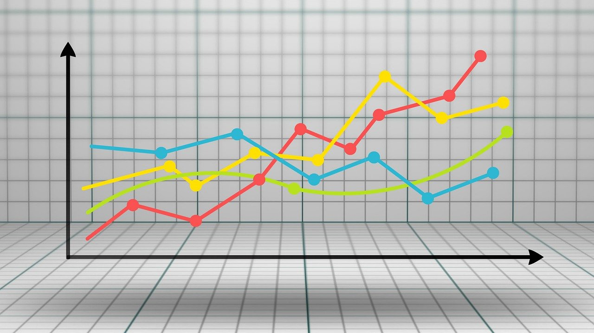

# Value Investing 

#### Source: [Pixabay](https://pixabay.com/illustrations/graph-diagram-growth-written-report-3033203/)

 ## Investment analysis based on the Graham and Buffett value investing methodology
 
 ## Data source - [Financial Modeling Prep API](https://financialmodelingprep.com/developer/docs)
 
 
## What is Value Investing?

Value investing process is based on the three key characteristics of financial markets, as originally defined by Graham and Dodd:[^1]

* The securities prices are subject to unexpected and significant daily movements.

* Despite these unpredictable movements in daily prices, many securities have fundamental economic values that are relatively stable and can be measured with reasonable accuracy by an investor.

* The strategy is to purchase a security when the market price is below the calculated **intrinsic value** by specified **margin of safety**, which will ensure superior long-term returns.

## Value Investing Process

The steps in value investing process are:[^2]

* Select security for valuation.

* Estimate fundamental values by analyzing financial statements, company competitive advantage, company management. 

* Specify the margin of safety.

* Make a decision about the number of securities to purchase and level of diversification/concentration of the portfolio.

* Make a decision when to sell the security.

## Key Terms

* Intrinsic Value - the discounted value of cash ([DCF Method](https://einvestingforbeginners.com/intrinsic-value-warren-buffett-aher/)) that can be taken out of a business during its remaining life.[^3] It is an estimate, not an exact figure. For the complete analysis and intrinsic value calculation refer to [intrinsic value notebook](intrinsic_value.ipynb).

* Margin of Safety - the difference between current market price and the intrinsic value (intrinsic value should be below the current market price). The higher the risk the higher margin should be. Traditionally 70% has been used. 

* Owners' Earnings — a company's net income plus depreciation and amortization, less the amount of capital expenditures and additional working capital that might be needed to operate the business as a going concern. Owner' earnings are equivalent to the cash that business owners demand from their businesses.[^4] Free cash flow can be used instead as a more conservative approach in the calculation of intrinsic value (used in my calculation).

* Return on Invested Capital (ROIC) - The measure of value creation. The only growth that creates value by producing a return above the cost of capital is in markets where the firm enjoys an actual competitive advantage or has the potential to create one, typically markets it can dominate in the future.[^5]

## Promising Candidates 

The best companies candidates for value investing approach are those with:[^6]

* Low debt.

* High current ratio.

* Consistent growth of ROE.

* Quality management.

* Persistent products. 

* Stable book value as a result of owners' earnings.

* Sustainable competitive advantage with high barriers to entry (moat).

## Resources:

[^1]:Greenwald, Bruce C.,Kahn, Judd,Bellissimo, Erin,Cooper, Mark A.,Santos, Tano. Value Investing: 396 (Wiley Finance) (p. 1). Wiley. Kindle Edition.

[^2]:Greenwald, Bruce C.,Kahn, Judd,Bellissimo, Erin,Cooper, Mark A.,Santos, Tano. Value Investing: 396 (Wiley Finance) (p. 2). Wiley. Kindle Edition. 

[^3]:Hagstrom, Robert G.. Warren Buffett (p. 129). Wiley. Kindle Edition.

[^4]:Hagstrom, Robert G.. Warren Buffett (pp. 122-123). Wiley. Kindle Edition.

[^5]:Greenwald, Bruce C.,Kahn, Judd,Bellissimo, Erin,Cooper, Mark A.,Santos, Tano. Value Investing: 396 (Wiley Finance) (p. 151). Wiley. Kindle Edition.

[^6]:Brodersen, Stig; Pysh, Preston. Warren Buffett Accounting Book: Reading Financial Statements for Value Investing (Warren Buffett's 3 Favorite Books Book 2) (p. 41). Pylon Publishing. Kindle Edition.

